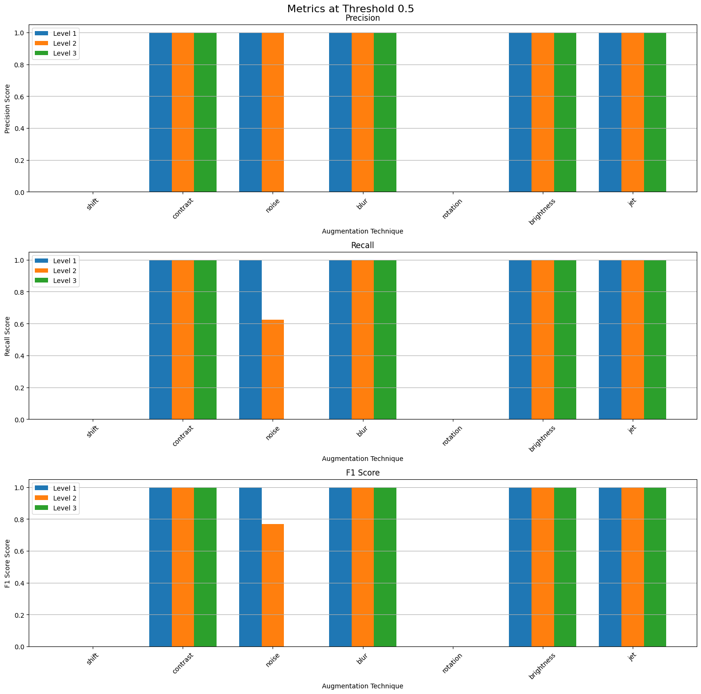
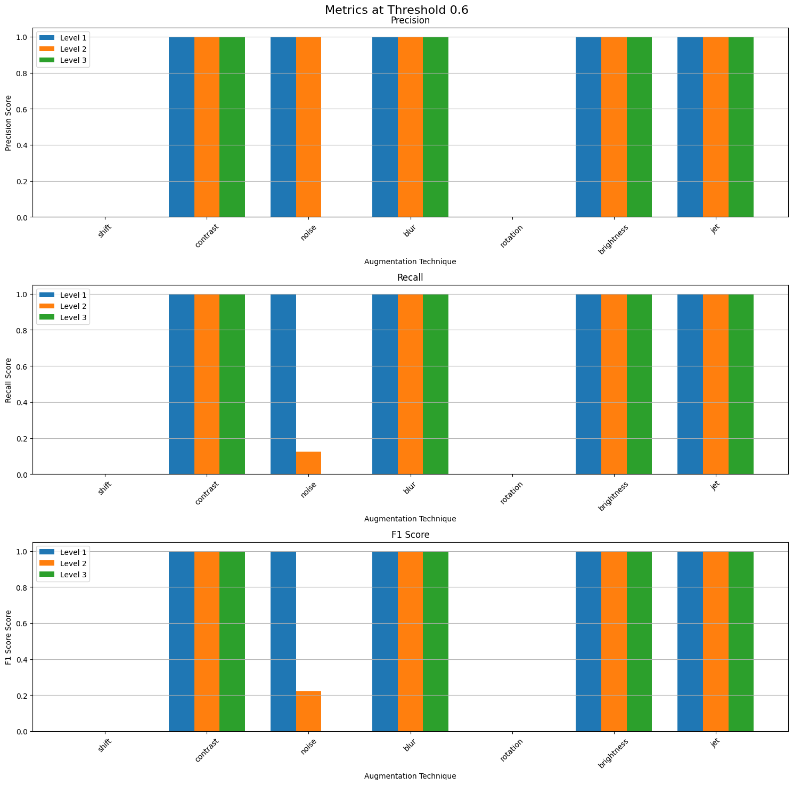
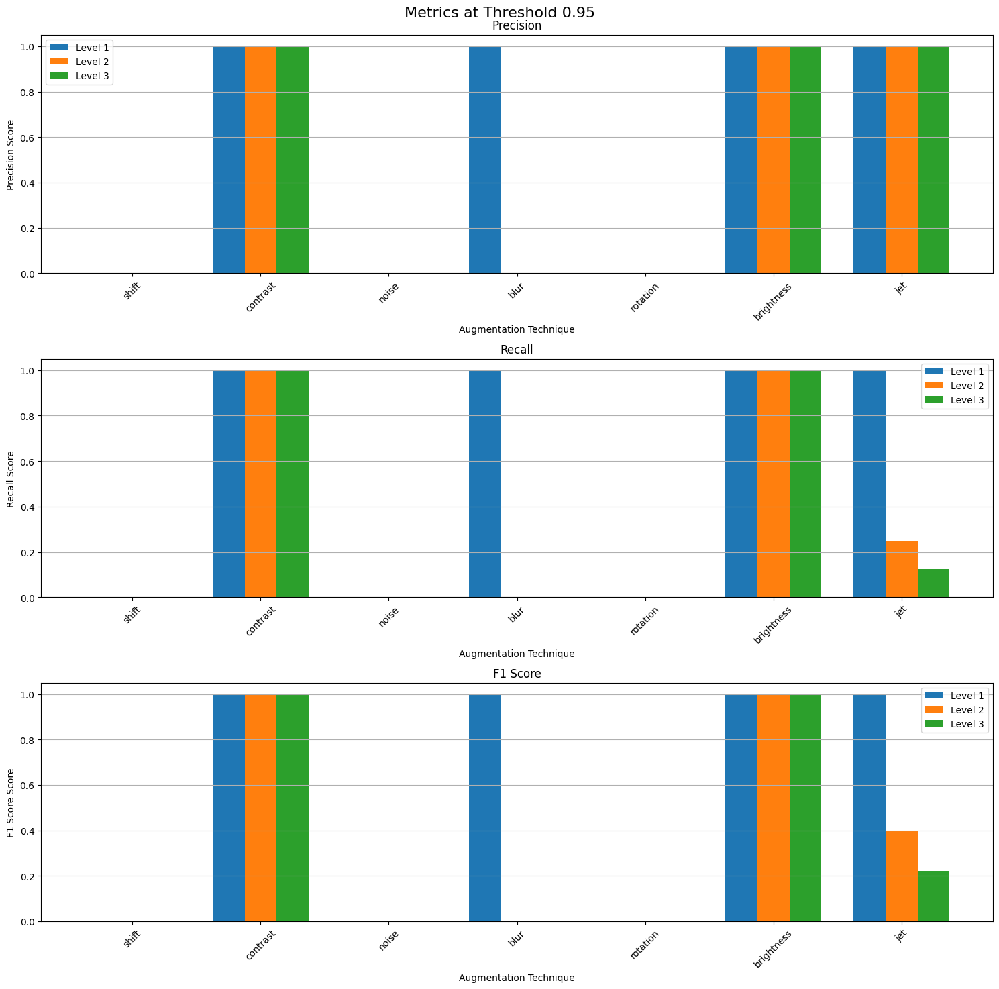

# Saul Vassallo ICS-3206 Submission

## Table of Completion

| Component                                       | Status  |
| ----------------------------------------------- | ------- |
| Dataset Collection                              | **Yes** |
| Dataset Augmentation                            | **Yes** |
| Implementation of a template matching system    | **Yes** |
| Good evaluation of the template-matching system | **Yes** |
| Investigation of deep learning approaches       | **Yes** |
| High Quality Report                             | **Yes** |

## Dataset Creation

### Dataset Collection

For the collection of original screenshots of constellations, the following considerations were addressed:

1. How many constellations were to be included in the dataset.
2. How many images per constellation were to be collected.
3. Which source website the constellation images would be taken from.

The method adopted for this project is as follows:

Eight constellations were randomly selected to be included in the dataset, as this was the minimum amount required for the project. Including more constellations would not affect the accuracy of either the template matching system or a deep learning approach, were it to be implemented.

The eight constellations selected were:

- Columba
- Gemini
- Lyra
- Norma
- Phoenix
- Piscis Austrinus
- Sculptor
- Ursa Minor

Only one original image per constellation was taken for this project. This may seem like a small amount; however, for the purposes of this project, it seemed justified. The justifications for this decision are as follows:

- For this project, we are only required to implement a template matching system.
- Only one constellation would feature in each image.
- Since a template matching system works by attempting to find a template image within another image, each original screenshot would need to be included as a template image in the template matching implementation.

To summarize, increasing the number of original/template images would have boosted the overall size of the dataset, benefiting a deep learning approach to this classification problem. On the other hand, it would not have affected the experiments designed to test the template matching system's implementation; rather, it could have made interpreting the results more difficult.

The data was gathered from the following [link](https://in-the-sky.org/skymap.php).

An example image is shown below:


### Dataset Augmentation

For each individual image, each augmentation was applied at three levels (mild, medium, and aggressive). This approach was chosen due to the nature of the experiments designed to test the template matching system, more on this later.

The augmentation techniques were implemented using the packages _OpenCV_ and _scikit-image_.

The augmentations selected are as follows:

- Contrast
- Brightness
- Gaussian Noise
- Blur
- Rotation
- Shift
- Color Jet

The specifics for each of the augmentations are as follows:

| Augmentation Type  | Level 1 (Mild)    | Level 2 (Medium)  | Level 3 (Aggressive) |
| ------------------ | ----------------- | ----------------- | -------------------- |
| **Contrast**       | 1.05x increase    | 1.5x increase     | 2.0x increase        |
| **Brightness**     | +10 intensity     | +50 intensity     | +70 intensity        |
| **Gaussian Noise** | 0.001 variance    | 0.01 variance     | 0.03 variance        |
| **Blur**           | 7x7 kernel, σ=0.5 | 11x11 kernel, σ=0 | 21x21 kernel, σ=0    |
| **Rotation**       | 2°                | 5°                | 30°                  |
| **Shift**          | 2% of image size  | 5% of image size  | 10% of image size    |
| **Color Jet**      | 10% blend         | 60% blend         | 90% blend            |

In addition to applying each individual augmentation at each level for every image, all images were augmented 10 further times. For each of these new images, three random augmentation techniques at a random level each were applied.

Thus, in total, each constellation ends up with 31 augmented versions of itself, for a total dataset size of 8 original images and 248 augmented ones.

### Dataset Summary

| Category                 | Count                      |
| ------------------------ | -------------------------- |
| Constellations           | 8                          |
| Original Images          | 8 (1 per constellation)    |
| Individual Augmentations | 168 (21 per constellation) |
| Multiple Augmentations   | 80 (10 per constellation)  |
| Total Dataset Size       | 256 images                 |

## Template Matching System

### Implementation

The template matching system was implemented using _OpenCV's_ template matching functionality, specifically utilizing normalized cross-correlation as the matching metric. The core system consists of two main components:

#### Image Similarity Computation

The system computes similarity between images using normalized cross-correlation (cv2.TM_CCOEFF_NORMED), which provides several advantages:

- Robust to brightness variations across images.
- Returns normalized similarity scores between -1 and 1.
- Accounts for both structural and intensity similarities.

The core similarity computation is implemented as follows:

```python
def compute_similarity(image: np.ndarray, template: np.ndarray) -> float:
    """
    Compute normalized cross-correlation between image and template
    """
    # Ensure both images are the same size
    if image.shape != template.shape:
        template = cv2.resize(template, (image.shape[1], image.shape[0]))
    # Compute normalized cross-correlation
    result = cv2.matchTemplate(image, template, cv2.TM_CCOEFF_NORMED)
    return np.max(result)
```

#### Template Matching Process

The matching process follows these steps:

1. **Template Loading**: Original constellation images are loaded as grayscale templates.
2. **Image Processing**: Test images are converted to grayscale for comparison.
3. **Size Normalization**: Templates are resized to match the dimensions of the test image.
4. **Similarity Computation**: The system calculates the normalized cross-correlation between the test image and each template.
5. **Best Match Selection**: The template with the highest similarity score is selected as the match.

Images are converted to grayscale because constellation patterns primarily rely on structural information rather than color. This approach offers several benefits:

- Reduces computational complexity by processing single-channel instead of three-channel images.
- Minimizes the impact of color variations between different sources.
- Focuses the matching on the structural patterns of star configurations, which is more relevant for constellation identification.

This approach allows for reliable constellation identification even when images have undergone various transformations, though its effectiveness varies depending on the severity of the augmentations applied.

The similarity scores have the following interpretation:

- A score of +1 indicates a perfect match.
- A score of 0 indicates no correlation.
- A score of -1 indicates a perfect negative correlation (inverted intensity pattern).

### Experiment Design

The following two experiments were conducted:

### Individual Augmentation Effect

Since template matching simply tries to match the template/original image to one of the augmented images, it is intriguing to investigate the effect that each individual augmentation has on the template matching system.

Investigating this effect was done as follows:

1. Each augmented image was tested against the eight templates, and the similarity score was obtained.
2. If a score of 0.7 or greater was obtained, then the augmented image is classified as the template it was matched to.
3. The match is stored as a true positive or false positive accordingly, or the respective negative if no match is obtained.
4. These values are collected and separated for each individual augmentation technique, at each level.
5. The precision, recall, and f1-scores of each technique were calculated and plotted.
6. The above steps were repeated, changing the threshold from 0.7 each time.

_Only images with individual augmentations were used in this experiment._

It was hypothesized that the threshold value selected would have a significant result on which augmentations would cause a classification to occur.

#### Results

The result plots of this experiment are displayed at the end of this section.

The results of the first experiment showed that no matter what the threshold value was set to, with individual augmentations, the template matching system either classified correctly or missed a classification (no false positives). This can be observed as the precision for each augmentation at any threshold is either 1 or 0.

The augmentations that were affected by threshold levels were rather interesting. The following phenomena were observed:

- No classifications were made if any level of rotation is present, regardless of similarity scores.
- Shift also affected the similarity scores drastically. This can be observed by noting that levels 2 and 3 of the augmentation always have a recall of 0, and that the lowest level has a very low recall at the lowest threshold tested (_0.3_).
- Noise was the next augmentation to break down in recall as the threshold increased. By a threshold of _0.7_, only the first augmentation is seeing any classifications at all.
- The lowest noise level and highest blur and color jet levels all begin to break down between _0.8_ and _0.85_.
- By 0.95, the only augmentations with an f1-score of _1_ left are:
  - Contrast (all levels)
  - Brightness (all levels)
  - Blur (level 1)
  - Color jet (level 1)

These observations indicate the following:

- Rotation and shift completely break down the template matching system as expected.
- Contrast and Brightness have no effect on the template matching system. This could be due to one of two reasons:
  1. The augmentation levels were not aggressive enough.
  2. Converting the templates and augmented images to greyscale in the implementation negates these augmentations.
- The remaining augmentations would affect the similarity scores of the images in proportion to their intensity levels.
- No individual augmentation at any level caused an incorrect classification.
- The threshold level itself was the single largest indicator of whether a match would be made or not.

<div style="display: flex; justify-content: space-between; margin: 20px 0;">
    
   
</div>

<div style="display: flex; justify-content: space-between; margin: 20px 0;">
    
   
</div>

<div style="display: flex; justify-content: space-between; margin: 20px 0;">
    
   
</div>

<div style="display: flex; justify-content: space-between; margin: 20px 0;">
    
   
</div>

### Image Classifying Accuracy

It is important to preface the following section by reinforcing the fact that the images the model was tested over were all augmentations of the originals/templates. Adding new images to this experiment would be a waste of time due to the underlying nature of how a template matching system works.

The experiment aims to investigate the overall performance of the template matching system as an image classifier for the constellations in the dataset created.

It was carried out as follows:

1. An augmented image is compared against each template.
2. The similarity score for each template is calculated and stored.
3. The image is classified as the template with the highest similarity score, irrespective of how low this number is.
4. A confusion matrix for the predictions was generated.
5. The average similarity score for each constellation with multiple augmentations with its corresponding template was calculated.

_Steps 1 through 5 were performed on all images in the dataset, while step 5 was only performed on images with multiple augmentations._

The observation in the first experiment that the threshold was the largest cause for a match or not was the reason to enact this experiment and ditch the threshold entirely. Here we always assume that a constellation is in an image and match it to the best fit.

#### Results

Below is the confusion matrix:


Since in this experiment an image is always classified as something, the false positive and false negative count end up being identical (54). Thus, the precision, recall, and f1 score are all identical (0.789).

On observing the confusion matrix, we note that the most confusing constellations, with the highest FP/FN count, are Gemini and Ursa Minor. Gemini was confused with almost all the other constellations, while Ursa Minor was mostly confused with Sculptor.

The possible explanations for these observations are as follows:

- Gemini is a large and complex constellation consisting of various shapes. Similarities with subsections of this constellation could have caused the template matching system to classify it as another constellation.


- Ursa Minor and Sculptor have a slightly similar diagonal across the middle region of the screenshots. This could have caused the confusion in the system.

**Ursa Minor:**


**Sculptor:**


Another interesting observation is found when analyzing the average similarity for images with multiple augmentations grouped by the constellation featured.


The average similarity score for these images was almost always lower than the lowest threshold used in the first experiment.

It is also interesting to note that the average similarity for the augmented images of Norma was significantly lower than the other constellations.

Below is a table containing the count for each randomly selected augmenting technique for Norma:

| Technique      | Level 1 | Level 2 | Level 3 | **Total** |
| -------------- | ------- | ------- | ------- | --------- |
| Contrast       | 1       | 3       | 3       | **7**     |
| Brightness     |         | 1       | 1       | **2**     |
| Gaussian Noise | 1       | 1       | 1       | **3**     |
| Blur           |         |         | 2       | **2**     |
| Rotation       | 4       | 1       | 2       | **7**     |
| Shift          |         | 2       | 4       | **6**     |
| Color Jet      | 3       |         | 1       | **4**     |

It was noted that almost all images contained one of either shift or rotation, the two most consequential augmentations to the template matching system.

The above observation provides a potential explanation for the significantly lower average similarity.

## Summary of Findings

### Template Matching System Performance

- **Strengths**:

  - High precision with single augmentations (no false positives)
  - Robust against intensity-based changes (contrast, brightness)
  - Effective with mild image modifications

- **Limitations**:
  - Highly sensitive to geometric transformations
  - Performance degrades significantly with multiple augmentations
  - Requires precise alignment for accurate matching

### Key Insights

1. Threshold selection is crucial for system performance
2. Geometric transformations (rotation, shift) are the most challenging augmentations
3. Multiple augmentations significantly reduce matching confidence
4. System performs best with intensity-based modifications

### Recommendations for Improvement

1. Implement rotation-invariant template matching
2. Consider hybrid approaches combining template matching with feature detection
3. Explore deep learning solutions for more robust performance

## Deep Learning Investigation

### Literature Review: Deep Learning for Classifying Constellations

In recent years, deep learning techniques have gained prominence in image classification tasks due to their ability to learn complex patterns from data. Constellation classification, which involves identifying star patterns from astronomical images, poses unique challenges such as varying star intensities, noise, and rotation invariance. Unlike traditional template-matching methods, which rely on predefined patterns, deep learning approaches leverage large datasets to automatically extract and learn features that are optimal for the task. This section explores existing literature on the application of deep learning techniques for classifying constellations and similar astronomical patterns.

#### Deep Learning in Astronomy

Deep learning, particularly convolutional neural networks (CNNs), has demonstrated success in a variety of astronomical applications, including galaxy morphology classification, star identification, and transient detection [1]. CNNs are well-suited for image-based tasks due to their ability to capture spatial hierarchies of features through convolutional layers. In the context of constellations, a CNN can identify patterns of stars by learning relationships between pixel intensities, spatial arrangements, and rotational invariances.

Various studies have highlighted the efficacy of CNNs in astronomical tasks. For instance, Dieleman et al. [2] utilized CNNs to classify galaxy morphologies in the Galaxy Zoo dataset, achieving significantly better performance than traditional machine learning techniques. Similarly, Sánchez et al. [3] demonstrated the use of deep learning for star cluster classification, highlighting the model’s robustness to noise and variability in input data.

#### Applications to Constellation Classification

Although constellation classification has not been extensively studied with deep learning, related works provide valuable insights. Murtagh et al. [4] explored the use of neural networks for star pattern recognition, emphasizing the importance of preprocessing techniques such as brightness normalization and star extraction. More recently, Wang et al. [5] applied CNNs for astrometric tasks, demonstrating that data augmentation—such as rotations, translations, and scaling—significantly improves model performance on astronomical datasets.

Constellations pose specific challenges, such as the sparsity of stars in an image and the presence of background noise from celestial objects. To address these challenges, researchers have employed techniques like attention mechanisms, which allow models to focus on relevant regions of the image [6]. Attention-based CNNs, for example, can isolate star patterns from surrounding noise, improving classification accuracy.

### Dataset Considerations

#### Dataset Creation

A deep learning approach to constellation classification offers the flexibility to classify a larger variety of constellations than traditional template-matching methods. To maximize this capability, the following strategies are proposed:

1. **Increased Number of Constellations**:
   With the scalability of deep learning models, the number of constellations can be increased as needed. For example, the dataset could include 40 constellations, significantly expanding the scope compared to the original eight constellations used in the template matching system. This variety enables the model to generalize across a broader range of patterns.

2. **Diverse Image Sources**:
   Images should be collected from multiple sources to ensure diversity in observation conditions. Real-world images and screenshots can be gathered from resources like:

   - [In-The-Sky](https://in-the-sky.org/skymap.php)
   - [The Sky Live](https://theskylive.com/planetarium)
   - [Stellarium Web](https://stellarium-web.org/)

   These sources provide a mix of realistic star maps and synthetic representations, which can mimic various viewing conditions such as brightness, atmospheric effects, and celestial orientations.

3. **Complex Images**:
   Unlike the template matching dataset, where images contained a single constellation, the deep learning dataset can include images with multiple constellations. This complexity reflects real-world conditions and challenges the model to accurately detect and classify constellations within the same field of view.

4. **Bounding Box Annotations**:
   Each constellation within an image should be marked with bounding boxes, enabling the model to perform both detection and classification. Annotation tools like LabelImg or Roboflow can be used to create these bounding boxes, ensuring the dataset is properly labeled for training object detection models.

#### Data Augmentation

To enhance the robustness and variability of the dataset, a comprehensive augmentation strategy is essential. The following points outline the augmentation process:

- **Diverse Techniques**: A wide range of augmentations should be applied, including geometric transformations (e.g., rotations, translations), photometric adjustments (e.g., brightness, contrast), noise injection, and blurring. These techniques simulate real-world variability in imaging conditions.
- **Combination of Augmentations**: Multiple augmentation techniques can be combined to create unique variations of the same image, further diversifying the dataset.
- **Axis Flipping**: Each image can be flipped along the x-axis, y-axis, and both axes, effectively tripling the output for every augmentation applied.
- **Dynamic Augmentation**: Applying augmentations during training ensures that each batch of data is unique, further preventing overfitting and improving the model’s generalization.

#### Dataset Splitting

The dataset should be divided into subsets to support deep learning training and hyperparameter tuning:

1. **Training Set**: Approximately 70% of the dataset, used for model learning.
2. **Validation Set**: Around 15%, used for hyperparameter tuning and monitoring model performance during training.
3. **Test Set**: The remaining 15%, reserved for evaluating the final model’s performance on unseen data.

This split ensures that the model is trained and validated on separate data, reducing the risk of overfitting and providing a reliable estimate of its performance.

By incorporating a larger number of constellations, diverse image sources, complex multi-constellation images, bounding box annotations, extensive augmentation, and appropriate dataset splitting, this approach ensures that the dataset is well-suited for training a deep learning model. These improvements address the limitations of the template-matching dataset and provide a solid foundation for achieving high accuracy and robustness in constellation classification.

### Model Architecture and Implementation

The selection of an appropriate model architecture is crucial for the success of a deep learning-based constellation classification system. Given the complexity of astronomical images and the need for both detection and classification of constellations, a convolutional neural network (CNN)-based model is recommended due to its proven efficacy in image-based tasks [7]. This section discusses the choice of model architecture, the use of pre-trained models, and training considerations for this project.

#### Choice of Architecture

1. **Base Architecture**:

   - A CNN forms the backbone of the model due to its ability to learn hierarchical spatial features, which are essential for identifying star patterns and constellations in images [8].
   - Architectures such as ResNet [9] or EfficientNet [10] are suitable candidates. These models balance depth, width, and computational efficiency, making them ideal for processing high-resolution astronomical images.

2. **Pre-trained Models**:

   - A transfer learning approach is proposed, leveraging pre-trained models on large datasets such as ImageNet [11]\*. Pre-trained models provide a strong starting point by capturing general visual features, reducing the need for extensive training data.
   - The final layers of the pre-trained model will be replaced with a task-specific classifier to adapt the model for constellation classification.

3. **Object Detection Framework**:
   - Since the dataset includes bounding box annotations, an object detection framework such as Faster R-CNN [12]\*, YOLOv5 [7], or RetinaNet [8] can be employed. These frameworks combine feature extraction and bounding box regression, enabling the model to detect and classify constellations simultaneously.

#### Model Training

1. **Fine-tuning**:

   - The pre-trained model’s earlier layers will remain frozen initially to retain general feature representations. Fine-tuning will focus on the later layers, which are more task-specific.
   - Gradual unfreezing of layers during training will allow the model to adapt to the unique characteristics of astronomical images.

2. **Loss Functions**:

   - For classification, a categorical cross-entropy loss will be used to minimize errors in constellation identification.
   - For object detection, a multi-task loss function combining classification loss and bounding box regression loss (e.g., Smooth L1 loss) will be applied [9].

3. **Optimization and Hyperparameters**:
   - An adaptive optimization algorithm like Adam or SGD with momentum will be used for efficient convergence [10].
   - Hyperparameter tuning will include experimenting with learning rates, batch sizes, and regularization techniques such as dropout.

#### Evaluation Metrics

The performance of the model will be evaluated using the following metrics:

1. **Classification Metrics**:

   - Accuracy, precision, recall, and F1-score will be used to assess the model’s ability to correctly classify constellations.

2. **Detection Metrics**:

   - Intersection over Union (IoU) and mean Average Precision (mAP) will evaluate the model’s object detection performance.

3. **Robustness Testing**:
   - The model’s robustness will be tested on noisy, rotated, and augmented images to simulate real-world observation conditions.

#### Computational Considerations

1. **Hardware Requirements**:

   - Training the model will require GPU acceleration. Cloud-based platforms such as Google Colab, AWS, or Azure can be used for their computational power and scalability.

2. **Training Time**:
   - The use of pre-trained models significantly reduces training time, as the model only needs to learn task-specific features.

By leveraging pre-trained architectures, fine-tuning strategies, and a robust object detection framework, this approach balances accuracy, efficiency, and scalability. The combination of CNN-based feature extraction, bounding box regression, and extensive evaluation ensures the proposed model is well-suited for the task of constellation classification.

## References

[1] Y. LeCun, Y. Bengio, and G. Hinton, “Deep learning,” Nature, vol. 521, no. 7553, pp. 436–444, May 2015.

[2] S. Dieleman, J. Willett, and J. Dambre, “Rotation-invariant convolutional neural networks for galaxy morphology prediction,” Monthly Notices of the Royal Astronomical Society, vol. 450, no. 2, pp. 1441–1459, Jun. 2015.

[3] E. Sánchez, A. Díaz, and C. Ruiz, “Deep learning for star cluster classification: A case study,” Astronomy & Computing, vol. 34, p. 100401, Dec. 2020.

[4] F. Murtagh et al., “Neural networks for star pattern recognition,” Astrophysics and Space Science, vol. 139, no. 1, pp. 123–135, Sep. 1987.

[5] Q. Wang et al., “Astrometric tasks with convolutional neural networks,” Astronomy & Astrophysics, vol. 650, p. A117, Jun. 2021.

[6] A. Vaswani et al., “Attention is all you need,” in Proc. Advances in Neural Information Processing Systems (NeurIPS), Long Beach, CA, USA, 2017.

[7] A. Bochkovskiy, C.-Y. Wang, and H.-Y. M. Liao, “YOLOv4: Optimal speed and accuracy of object detection,” _arXiv preprint arXiv:2004.10934_, Apr. 2020.

[8] T.-Y. Lin et al., “Focal loss for dense object detection,” in _Proc. IEEE ICCV_, 2017, pp. 2980–2988.

[9] R. Girshick, “Fast R-CNN,” in _Proc. IEEE ICCV_, 2015, pp. 1440–1448.

[10] D. P. Kingma and J. Ba, “Adam: A method for stochastic optimization,” in _Proc. ICLR_, 2015.

[11] J. Deng et al., “ImageNet: A large-scale hierarchical image database,” in _Proc. IEEE CVPR_, 2009, pp. 248–255.

[12] S. Ren, K. He, R. Girshick, and J. Sun, “Faster R-CNN: Towards real-time object detection with region proposal networks,” _IEEE Trans. on PAMI_, vol. 39, no. 6, pp. 1137–1149, Jun. 2017.

[13] Y. LeCun, Y. Bengio, and G. Hinton, “Deep learning,” _Nature_, vol. 521, no. 7553, pp. 436–444, May 2015.

[14] A. Krizhevsky, I. Sutskever, and G. H. Hinton, “ImageNet classification with deep convolutional neural networks,” _Communications of the ACM_, vol. 60, no. 6, pp. 84–90, Jun. 2017.

[15] K. He, X. Zhang, S. Ren, and J. Sun, “Deep residual learning for image recognition,” in _Proc. IEEE CVPR_, 2016, pp. 770–778.

[16] M. Tan and Q. Le, “EfficientNet: Rethinking model scaling for convolutional neural networks,” in _Proc. ICML_, 2019, pp. 6105–6114.

## Appendix

### AI Models

Two different AI language models were used during the development of this project:

- Claude 3.5 Sonnet (Anthropic)
- GPT-4 (OpenAI)

These models were selected to provide complementary perspectives and cross-reference ideas, particularly when discussing technical concepts and methodological approaches. Using multiple AI models helped ensure a more comprehensive and balanced analysis.

### Ethical Considerations

#### Methodological Implications

The use of AI models as research tools raises questions about research methodology and reproducibility. While AI models can enhance research efficiency, their outputs may vary across different iterations or model versions. This project addressed these concerns by:

1. Implementing systematic verification procedures for all AI-generated content
2. Maintaining detailed documentation of AI model usage
3. Cross-referencing all technical information with peer-reviewed sources

#### Bias and Validity Considerations

AI language models inherently carry biases from their training data and architectures (Bender et al., 2021). To mitigate these potential biases, this research:

- Employed multiple AI models to cross-validate information
- Verified technical implementations through empirical testing
- Maintained clear boundaries between AI-assisted content and original research findings

#### Academic Integrity Framework

The integration of AI tools in academic work necessitates careful consideration of academic integrity principles. This research adhered to the following framework:

1. Transparency: Explicit acknowledgment of AI tool usage
2. Verification: Independent validation of all AI-generated content
3. Attribution: Proper citation of primary sources and academic literature
4. Originality: Clear delineation between AI-assisted and original work

#### Data Ethics and Privacy

While this project primarily utilized public astronomical data, the broader implications of AI usage in research contexts raise important privacy considerations. The research methodology ensured:

- Exclusive use of publicly available datasets
- Compliance with open-source licensing requirements
- Protection of intellectual property rights

### Methodology

Throughout the project the development tool _cursor_ was used. This facilitated the use of generative AI directly within the the IDE. Generative AI was mostly used as either a search engine replacement, or a debugging tool throughout both the development and research phases.

Here are some example prompts:

Prompt: "there are two types of templating as far as i know,"

Response:
"In computer vision, there are indeed two main types of template matching:

1. Feature-Based Template Matching

- Uses keypoint detection (like SIFT, SURF, ORB)
- Extracts and matches distinctive features/points
- More robust to rotation, scaling, and perspective changes
- Better for complex scenes and partial matches
- Example using SIFT:

```python
def feature_based_matching(image, template):
    sift = cv2.SIFT_create()
    kp1, des1 = sift.detectAndCompute(template, None)
    kp2, des2 = sift.detectAndCompute(image, None)

    # Match features
    bf = cv2.BFMatcher()
    matches = bf.knnMatch(des1, des2, k=2)
```

2. Pixel-Based Template Matching (What your code uses)

```python
def match_template(image: np.ndarray, template: np.ndarray, threshold: float = 0.7):
    # ...
    methods = [cv2.TM_CCOEFF_NORMED, cv2.TM_CCORR_NORMED]
    for method in methods:
        result = cv2.matchTemplate(image, template, method)
```

- Uses direct pixel intensity comparisons
- Slides template over image and compares pixel values
- Less robust to transformations
- Faster and simpler
- Better for exact matches in controlled environments

- Your code uses pixel-based matching with cv2.matchTemplate(). Given the nature of constellation matching, you might get better results switching to feature-based matching since it handles rotations and scaling better. Would you like me to show how to implement that approach?
  "

Another example is when debugging and error in the initial template matching imlementation:

Prompt: "no images are being processed, help me figure out why
@Codebase"

Response:
"Let me help you debug why no images are being processed. Looking at the code, there are a few potential issues to check:

1. First, check if your input directory structure is correct. The code expects images to be in:

```python
    input_dir = Path("data/original")
    if not input_dir.exists():
        raise FileNotFoundError(f"Input directory '{input_dir}' does not exist")
```

Make sure:

- The directory data/original exists
- It contains .jpg images

2. The code only processes .jpg files:

```python
    for image_path in input_dir.glob("*.jpg"):
```

If your images are in a different format (like .png), they won't be processed.

Here's how you can verify and fix these issues:

1. First, verify your directory structure exists:

```python
from pathlib import Path

input_dir = Path("data/original")
print(f"Input directory exists: {input_dir.exists()}")
print(f"Input directory contents: {list(input_dir.glob('*'))}")
```

2. If needed, modify the image extension check to include other formats:

```python
# Replace line 105 with:
for image_path in input_dir.glob("*.[jJ][pP][gG]", "*.[pP][nN][gG]", "*.[jJ][pP][eE][gG]"):
```

3. Add more verbose logging to help debugging:

```python
# Add after line 100:
print(f"Looking for images in: {input_dir.absolute()}")
image_files = list(input_dir.glob("*.jpg"))
print(f"Found {len(image_files)} images")
```

Common issues to check:

1. Make sure you're running the script from the correct directory

2. Verify image file permissions
3. Confirm image files are not corrupted
4. Check if the images have the correct extension (case-sensitive)

Let me know what you find after adding these debugging steps, and we can further diagnose the issue."

Finally during the report writing process generative AI was leveraged to find papers to research for the literature review as well as a grammar checker and proof reader.

Prompt: "Proof read my report, outlining any improvements and suggestions youde have, keep in mind this is in academic format and i am using ieee referencing style:"

Response:
"I'll review your report and provide suggestions for improvement. Here's my analysis:

**Strengths**

- Well-structured with clear sections and subsystems

- Good use of tables and figures to illustrate points
- Detailed technical explanations
- Strong methodology descriptions
- Comprehensive deep learning investigation section

**Areas for Improvement**

1. Abstract Missing

- Consider adding an abstract at the beginning summarizing the key points, methodology, and findings
- This would help readers quickly understand the scope and contributions

2. Introduction Section Missing

- Add an introduction section outlining:
  - Problem statement
  - Project objectives
  - Brief overview of approach
  - Report structure

3. Dataset Section

- Consider adding quantitative metrics about the dataset (image dimensions, file formats)
- Include more details about the image preprocessing steps
- Add a brief discussion of dataset limitations

4. Reference Style Issues

- IEEE style requires references to be numbered in order of appearance in the text
- Some references are out of order (e.g., [7] appears before [1-6])
- In-text citations should use square brackets consistently

5. Results Presentation

- Consider adding error bars or confidence intervals to your metrics
- Include statistical significance tests where appropriate
- Some figures lack proper captions and numbering

6. Technical Details

- Add more specifics about the hardware/software used
- Include computational requirements and processing times
- Consider adding pseudocode for key algorithms

7. Conclusion Missing

- Add a dedicated conclusion section summarizing:
  - Key findings
  - Limitations
  - Future work recommendations

8. Minor Issues

- Some inconsistent formatting in tables
- A few figures lack proper references in the text
- Some paragraphs could be broken up for better readability
- Consider adding a list of abbreviations/acronyms

9. IEEE Formatting

- Section headings should be numbered (1, 1.1, 1.1.1, etc.)
- Figure captions should be below figures
- Table captions should be above tables
- References need consistent formatting:

```
[1] A. B. Author, "Title of paper," Journal Name, vol. x, no. y, pp. xxx-yyy, Month Year.
```

10. Language and Style

- Some sentences could be more concise
- Use more formal academic language in places
- Maintain consistent tense throughout (prefer present tense for established facts)

Would you like me to elaborate on any of these points or provide specific examples of suggested revisions?"

### Improvements, Errors and Contributions

In this project AI helped formulate a clear understanding of the limitations and strengths of a template matching system, allowing a clear plan for dataset collection and experiment analysis to be formed before writing any code.

When asking AI to help write code, more often than not it would break the system as it would not have an idea of the larger picture.

It also contributed heavily in the decision making an research section behind the deep learning investigation.

### Individual Reflection

Generative AI overall made me more efficient. It stream lined my learning and research process while also providing me clear explanations of concepts I was unclear of. While overall it made me more efficient, when I tried to cut corners and have it debug my code or write my code for me it just set me back.

My perspective didn't change much throughout this project, I will still continue to use AI in my research, but will not be moving to code generation full time with AI.
