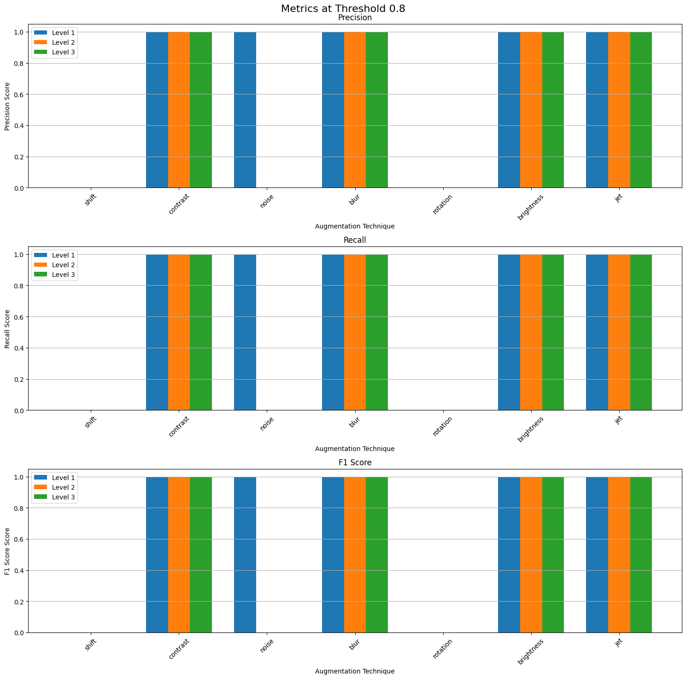
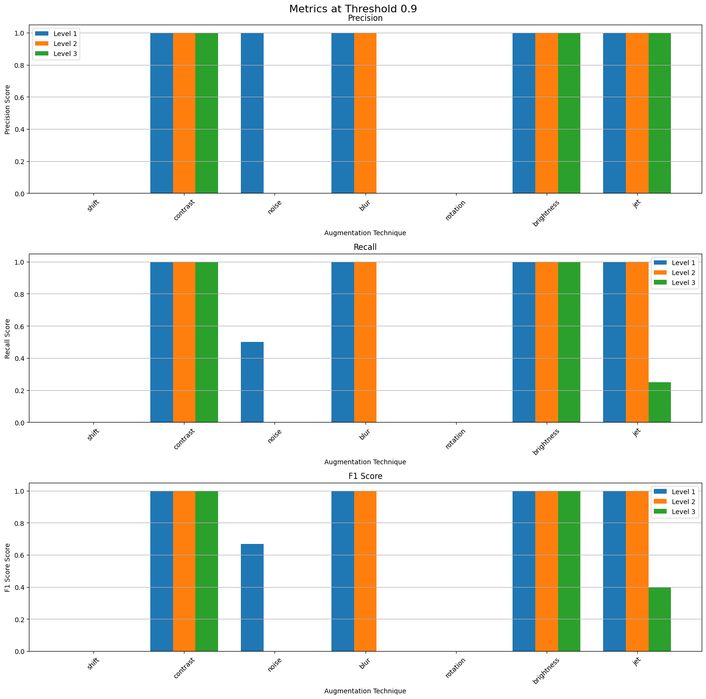

# Saul Vassallo ICS-3206 Submission

## Table of Completion

| Component                                       | Status  |
| ----------------------------------------------- | ------- |
| Dataset Collection                              | **Yes** |
| Dataset Augmentation                            | **Yes** |
| Implementation of a template matching system    | **Yes** |
| Good evaluation of the template-matching system | **Yes** |
| Investigation of deep learning approaches       | **Yes** |
| High Quality Report                             | **Yes** |

## Dataset Creation

### Dataset Collection

For the collection of original screen shots of constellations the following considerations had to be answered:

1. How many constellations were to be included in the dataset
2. How many images per constellation were to be collected
3. Which source website the constellation images would be taken from

The method adopted for this project is as follows.

8 constellations were selected randomly to be included in the dataset as this was the minimum amount required for the project and including more constellations would not affect the accuracy of either the template matching system or a deep learning approach were it to be implemented.

The 8 constellations selected were:

- Columba
- Gemini
- Lyra
- Norma
- Phoenix
- Piscis Austrinus
- Sculptor
- Ursa Minor

Only 1 original image per constellation was taken for this project, this may seem like a small amount, however, for the purposes of this project this seemed justified. The justifications for this decision are as follows:

- For this project we are only required to implement a template matching system.
- Only one constellation would feature in each image.
- Since a template matching system works by attempting to find a template image within another image, each original screenshot would need to be included as a template image in the template matching implementation.

To summarize, increasing the amount of original/template images would have boosted the overall size of the dataset, benefitting a deep learning approach to this classification problem. On the other hand it would not have affected the experiments designed to test the template matching systems implementation, rather it could have made interpreting the results more difficult.

The data was gathered from the following [link](<[link](https://in-the-sky.org/skymap.php)>).

An example image is shown below:


### Dataset Augmentation

For each individual image, each individual augmentation was applied at 3 levels (mild augmentation, medium augmentation and aggressive augmentation). This approach was chosen due to the nature of the experiments designed to test the template matching system, more on this later.

The augmentation techniques were implemented using the packages _OpenCV_ and _scikit image_.

The augmentations selected are as follows:

- Contrast
- Brightness
- Gaussian Noise
- Blur
- Rotation
- Shift
- Color Jet

The specifics for each of the augmentations is as follows:

| Augmentation Type  | Level 1 (Mild)    | Level 2 (Medium)  | Level 3 (Aggressive) |
| ------------------ | ----------------- | ----------------- | -------------------- |
| **Contrast**       | 1.05x increase    | 1.5x increase     | 2.0x increase        |
| **Brightness**     | +10 intensity     | +50 intensity     | +70 intensity        |
| **Gaussian Noise** | 0.001 variance    | 0.01 variance     | 0.03 variance        |
| **Blur**           | 7x7 kernel, σ=0.5 | 11x11 kernel, σ=0 | 21x21 kernel, σ=0    |
| **Rotation**       | 2°                | 5°                | 30°                  |
| **Shift**          | 2% of image size  | 5% of image size  | 10% of image size    |
| **Color Jet**      | 10% blend         | 60% blend         | 90% blend            |

As well as applying each individual augmentation at each level for every image. All images were augmented 10 further times. For each of these new images, 3 random augmentation techniques at a random level each were applied.

Thus in total, each constellation ends up with 31 augmented versions of itself, for a total dataset size of 8 original images and 248 augmented ones.

## Template Matching System

### Implementation

The template matching system was implemented using _OpenCV's_ template matching functionality, specifically utilizing normalized cross-correlation as the matching metric. The core system consists of two main components:

#### Image Similarity Computation

The system computes similarity between images using normalized cross-correlation (cv2.TM_CCOEFF_NORMED), which provides several advantages:

- Robust to brightness variations across images
- Returns normalized similarity scores between -1 and 1
- Accounts for both structural and intensity similarities

The core similarity computation is implemented as follows:

```python
def compute_similarity(image: np.ndarray, template: np.ndarray) -> float:
    """
    Compute normalized cross-correlation between image and template
    """
    # Ensure both images are the same size
    if image.shape != template.shape:
        template = cv2.resize(template, (image.shape[1], image.shape[0]))
    # Compute normalized cross-correlation
    result = cv2.matchTemplate(image, template, cv2.TM_CCOEFF_NORMED)
    return np.max(result)
```

#### Template Matching Process

The matching process follows these steps:

1. **Template Loading**: Original constellation images are loaded as grayscale templates
2. **Image Processing**: Test images are converted to grayscale for comparison
3. **Size Normalization**: Templates are resized to match the dimensions of the test image
4. **Similarity Computation**: The system calculates the normalized cross-correlation between the test image and each template
5. **Best Match Selection**: The template with the highest similarity score is selected as the match

Images are converted to grayscale because constellation patterns primarily rely on structural information rather than color. This approach offers several benefits:

- Reduces computational complexity by processing single-channel instead of three-channel images
- Minimizes the impact of color variations between different sources
- Focuses the matching on the structural patterns of star configurations, which is more relevant for constellation identification

This approach allows for reliable constellation identification even when images have undergone various transformations, though its effectiveness varies depending on the severity of the augmentations applied.

The similarity scores have the following interpretation:

- A score of +1 indicates a perfect match
- A score of 0 indicates no correlation
- A score of -1 indicates a perfect negative correlation (inverted intensity pattern)

### Experiment Design

The following 2 experiments were conducted:

### Individual Augmentation Effect

Since template matching simply tries to match the template/original image to one of the augmented images, it is intriguing to investigate the effect that each individual augmentation has on the template matching system.

Investigating this effect was done as follows:

1. Each augmented image was tested against the 8 templates and the similarity score was obtained
2. If a score of 0.7 or greater was obtained then the augmented image is classified as the template it was matched to.
3. The match is stored as a true positive false positive accordingly, or the respective negative if no match is obtained.
4. These values are collected and separated for each individual augmentation technique, at each level.
5. The precision, recall and f1-scores of each technique were calculated and plotted.
6. The above steps were repeated, changing the threshold from 0.7 each time

_Only images with individual augmentations were used in this experiment._

It was hypothesized that the threshold value selected would have a significant result on which augmentations would cause a classification to occur.

#### Results

The result plots of this experiment are displayed at the end of this section.

The results of the 1st experiment showed that no matter what the threshold value was set to, with individual augmentations, the template matching system either classified correctly, or missed a classification (no false positives). This can be observed as the precision for each augmentation at any threshold is either 1 or 0.

The augmentations that were affected by threshold levels was rather interesting. the following phenomena were observed:

- No classifications were made if any level of rotation is present. regardless of similarity scores.
- Shift also affected the similarity scores drastically. This can be observed by noting that levels 2 and 3 of the augmentation always have a recall of 0, and that the lowest level has a very low recall at the lowest threshold tested (_0.3_).
- Noise was the next augmentation to break down in recall as the threshold increased. By a threshold of _0.7_ only the 1st augmentation is seeing any classifications at all.
- The lowest noise level and highest blur and color jet levels all begin to break down in between _0.8_ and _0.85_
- By 0.95 the only augmentations with an f1-score of _1_ left are:
  - Contrast (all levels)
  - Brightness (all levels)
  - Blur (level 1)
  - Color jet (level 1)

These observations indicate the following:

- Rotation and shift completely break down the template matching system as expected.
- Contrast and Brightness have no effect on the template matching system. This could be due to 1 of 2 reasons:
  1. The augmentation levels were not aggressive enough
  2. Converting the templates and augmented images to greyscale in the implementation negates these augmentations.
- The remaining augmentations would affect the similarity scores of the images in proportion to their intensity levels.
- No individual augmentation at any level caused an incorrect classification.
- The threshold level itself was the single largest indicator of whether a match would be made or not.

<div style="display: flex; justify-content: space-between; margin: 20px 0;">
    
   
</div>

<div style="display: flex; justify-content: space-between; margin: 20px 0;">
    
   
</div>

<div style="display: flex; justify-content: space-between; margin: 20px 0;">
    
   
</div>

<div style="display: flex; justify-content: space-between; margin: 20px 0;">
    
   
</div>

### Image Classifying Accuracy

It is important to preface the following section by reinforcing the fact that the images the model was tested over were all augmentations of the originals/templates, adding new images to this experiment would be a wast of time due to the underlying nature of how a template matching system works.

The experiment aims to investigate the overall performance of the template matching system as an image classifier for the constellations in the dataset created.

It was carried out as follows:

1. An augmented image is compared against each template.
2. The similarity score for each template is calculated and stored.
3. The image is classified as the template with the highest similarity score, irrespective of how low this number is.
4. A confusion matrix for the predictions was generated.
5. The average similarity score for each constellation with multiple augmentations with its corresponding template was calculated.

_Steps 1 through 5 were performed on all images in the dataset, while step 5 was only performed on images with multiple augmentations._

The observation in the first experiment that the threshold was the largest cause for a match or not was the reason to enact this experiment and ditch the threshold entirely. Here we always assume that a constellation is in an image, and match it to the best fit.

#### Results

Below is the confusion matrix:


Since in this experiment an image is always classified as something, the false positive and false negative count end up being identical (54). Thus the precision, recall and f1 score are all identical (0.789).

On observing the confusion matrix we note that the most confusing constellations, highest FP/FN count, are gemini and ursa minor. Gemini was confused with almost all the other constellations while ursa minor was mostly confused with sculptor.

the possible explenations for these observations are as follows:

- gemini is a large and complex consteallation consisting of various shapes, similarites with subsections of this constellation could have caused the template matching system to classyify it as another consteallation.


- Ursa Minor and sculptor have a slightly similar diagonal across the middle region of the screen shots. this could have caused the confusion in the system.

**Ursa Minor:**


**Sculptor:**


Another interesting observation is found when analysing the average similarity for images with multiple augmentations grouped by the constealltion featured.


The average similarity score for these images was almost always lower than the lowest threshold used in the first experiment.

It is also interesting to note that the average similarity for the augmented images of norma was significantly lower than the other constellations.

Below is a table containing the count for each randomly selected augmenting techniques for norma

| Technique      | Level 1 | Level 2 | Level 3 | **Total** |
| -------------- | ------- | ------- | ------- | --------- |
| Contrast       | 1       | 3       | 3       | **7**     |
| Brightness     |         | 1       | 1       | **2**     |
| Gaussian Noise | 1       | 1       | 1       | **3**     |
| Blur           |         |         | 2       | **2**     |
| Rotation       | 4       | 1       | 2       | **7**     |
| Shift          |         | 2       | 4       | **6**     |
| Color Jet      | 3       |         | 1       | **4**     |

It was noted that almost all images contained 1 of either shift or rotation, the 2 most consequential augmentations to the template matching system.

The above observation provides a potential explanation to the significantly lower average similarity.
